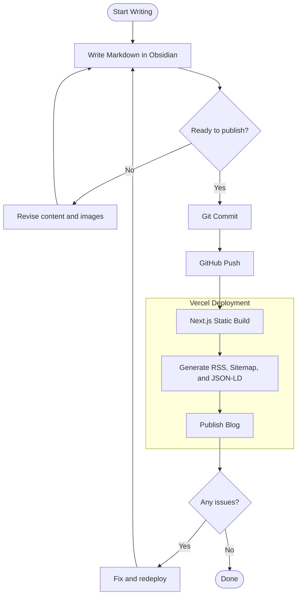

Welcome to the Obsidian Blog Kit!
## How to Write

1. Create a new note (`Ctrl/Cmd+N`) — template is auto-applied
2. Toggle `published` on in frontmatter
3. `Ctrl+P` → **Obsidian Git: Push** (or `git push` from terminal)
4. Vercel auto-builds & deploys

## Frontmatter

| Field       | Type    | Required | Description                             |
| ----------- | ------- | -------- | --------------------------------------- |
| `date`      | string  | Yes      | Publication date (YYYY-MM-DD)           |
| `published` | boolean | Yes      | Publish toggle                          |
| `slug`      | string  | No       | URL path (auto-generated from filename) |
| `thumbnail` | string  | No       | Thumbnail image path                    |

> Auto-handled
> - `title` is derived from the filename
> - `description` meta tag is auto-extracted from the first 160 characters
> - `slug` is auto-generated from filename if empty
> - Pasted images are auto-saved to `public/images/`

## Image Example


## Supported Markdown

**Bold**, *italic*, ~~strikethrough~~, `inline code`

> Blockquotes are supported too.

```typescript
function greet(name: string): string {
  return "Hello, " + name + "!"
}
```

| Feature            | Supported |
| ------------------ | --------- |
| Headings (h1-h6)   | Yes       |
| Code blocks (Shiki) | Yes      |
| Tables (GFM)       | Yes       |
| Images             | Yes       |
| Math (KaTeX)       | Yes       |

### Math

Inline math: $E = mc^2$

Block math:

$$
\sum_{i=1}^{n} x_i = x_1 + x_2 + \cdots + x_n
$$

### Mermaid



---

Edit or delete this sample post, and start writing your own!
